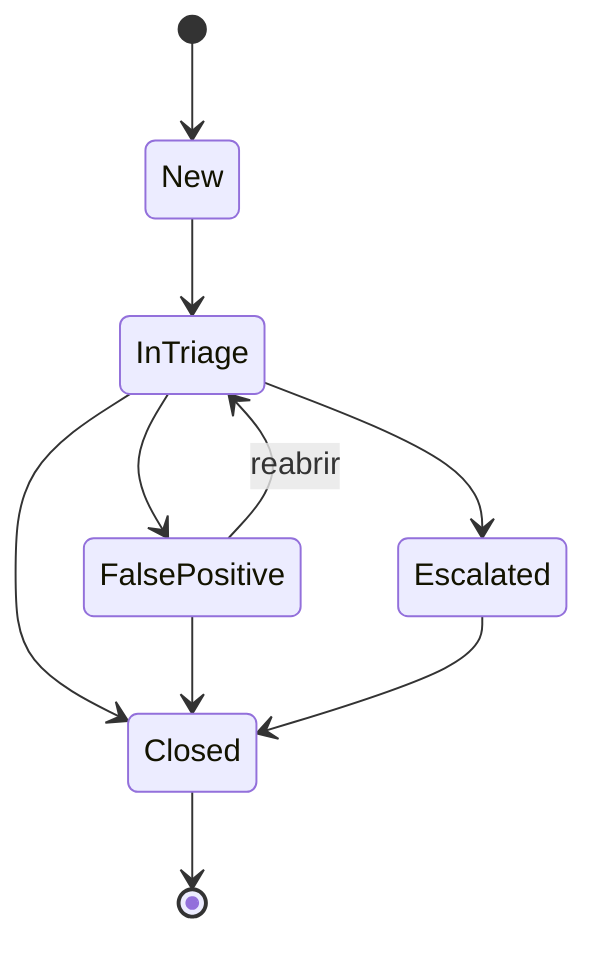

# AlertTriage API

API em **ASP.NET Core (.NET 10)** para triagem de alertas de segurança. Ela recebe alertas de fontes como SIEM e EDR, remove duplicados, controla o ciclo de vida de cada alerta e mantém uma trilha de auditoria das mudanças de status.

O domínio vem da rotina de um SOC: em vez de mais um CRUD genérico, o projeto modela problemas reais de triagem, como ruído por alertas repetidos e a necessidade de saber quem mudou o quê e quando.

## Funcionalidades

- **Ingestão de alertas** (`POST /alerts`) com validação de entrada
- **Deduplicação por fingerprint**: o mesmo alerta (fonte + regra + host) dentro de 15 minutos não gera um registro novo; o existente incrementa o contador de ocorrências e sobe a severidade se a nova for maior (nunca reduz)
- **Ciclo de vida com regras de transição**: transições inválidas são rejeitadas com `409 Conflict`
- **Histórico de auditoria**: cada mudança de status registra origem, destino, responsável, observação e data
- **Consulta** de alertas recentes e detalhe de um alerta com seu histórico

## Fluxo de status



## Stack

| Área | Tecnologia |
|---|---|
| Linguagem / runtime | C# 14, .NET 10 |
| Web | ASP.NET Core Minimal APIs, OpenAPI |
| Dados | Entity Framework Core, PostgreSQL 17 |
| Testes | xUnit, `FakeTimeProvider` |
| Infraestrutura local | Docker Compose |

## Arquitetura

Separação em camadas, com dependências apontando para o domínio:

```
src/
├── AlertTriage.Domain/          # entidades e regras de negócio (Alert, transições, fingerprint)
├── AlertTriage.Application/     # casos de uso (CreateAlertService, ChangeAlertStatusService) e contratos
├── AlertTriage.Infrastructure/  # EF Core, DbContext, repositório, migrations
└── AlertTriage.Api/             # endpoints, DI e configuração
tests/
└── AlertTriage.UnitTests/       # testes do domínio e dos casos de uso
```

Decisões de projeto:

- **Domínio rico**: `Alert` tem construtor privado e só é criado por `Alert.Create`, então não existe alerta inválido em memória. Mudanças de status passam por `ChangeStatus`, que aplica as regras de transição.
- **Relógio injetável** (`TimeProvider`): as regras de janela de deduplicação são testáveis sem depender da hora real.
- **Repositório atrás de interface**: os casos de uso são testados com um repositório em memória, sem banco.
- **Enums como texto** no banco e na API, para facilitar leitura e depuração.

## Como rodar

Pré-requisitos: [.NET SDK 10](https://dotnet.microsoft.com/download) e Docker.

```bash
# 1. subir o PostgreSQL
docker compose up -d

# 2. instalar a ferramenta de migrations (uma vez)
dotnet tool install --global dotnet-ef

# 3. aplicar as migrations
dotnet ef database update \
  --project src/AlertTriage.Infrastructure \
  --startup-project src/AlertTriage.Api

# 4. rodar a API
dotnet run --project src/AlertTriage.Api
```

A URL aparece no terminal (por exemplo `http://localhost:5183`). Em desenvolvimento, o documento OpenAPI fica em `/openapi/v1.json`.

> As credenciais do banco em `docker-compose.yml` e `appsettings.Development.json` servem **apenas para desenvolvimento local**. Em qualquer outro ambiente, a connection string deve vir de variável de ambiente ou de um cofre de segredos.

## Endpoints

| Método | Rota | Descrição | Respostas |
|---|---|---|---|
| `POST` | `/alerts` | Cria um alerta ou registra uma ocorrência em um existente | `201` novo, `200` duplicado, `400` inválido |
| `GET` | `/alerts` | Lista os 50 alertas mais recentes | `200` |
| `GET` | `/alerts/{id}` | Detalhe do alerta com histórico | `200`, `404` |
| `PATCH` | `/alerts/{id}/status` | Muda o status do alerta | `200`, `400`, `404`, `409` |

### Exemplos

Criar um alerta:

```bash
curl -X POST http://localhost:5183/alerts \
  -H "Content-Type: application/json" \
  -d '{"source":"Wazuh","rule":"Multiple failed logins","host":"SRV-01","severity":"High"}'
```

Enviar o mesmo alerta de novo dentro de 15 minutos retorna `200 OK` com `occurrenceCount` incrementado, em vez de criar outro registro.

Assumir o alerta para triagem:

```bash
curl -X PATCH http://localhost:5183/alerts/{id}/status \
  -H "Content-Type: application/json" \
  -d '{"status":"InTriage","changedBy":"jean","note":"Assumindo o alerta"}'
```

Uma transição inválida (por exemplo `InTriage` para `New`) retorna `409 Conflict` com a mensagem do erro.

## Testes

```bash
dotnet test
```

Os testes cobrem validação de entrada, normalização e diferenciação do fingerprint, janela de deduplicação (dentro e fora dos 15 minutos), elevação de severidade, regras de transição de status e comportamento dos casos de uso.

## Roadmap

- [ ] Autenticação JWT com papéis (Analyst e Admin); `changedBy` passa a vir do token
- [ ] Filtros, paginação e ordenação em `GET /alerts`
- [ ] Testes de integração com `WebApplicationFactory`
- [ ] Dockerfile da API e execução completa via Docker Compose
- [ ] Pipeline de CI no GitHub Actions: build, testes, CodeQL e verificação de dependências vulneráveis
- [ ] Tratamento global de erros (ProblemDetails), rate limiting e logs estruturados

## Autor

**Jean Fogaça**, analista de cibersegurança com experiência em SOC e em desenvolvimento de software.

[LinkedIn](https://linkedin.com/in/jean-fogaca) · [GitHub](https://github.com/jeamf)
